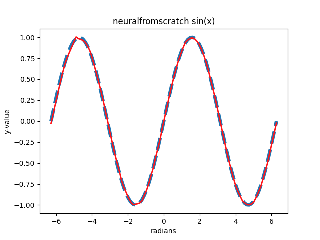

# Neural Network from Scratch

This project is a personal challenge to build a simple neural network from scratch using only Python and NumPy.

## About

The goal is to create a neural network capable of learning to approximate the sine function (`y = sin(x)`).

To create the neural network I originally used 2 main classes:
1.  `Layer` - stores an array of weights and biases, produces an output for the layer given an input, and contains multiple activation functions used in the calculations 
2.  `Network` - creates a series of connected layers that can do forward passes through the network and allows for a back pass as well that implements back propagation

Since almost all the code behind the network uses numpy's quick matrix multiplication, the network is quite fast... though almost no other optimizations exist that make it faster.

## Results

The following graph shows the network's prediction of sine (the red solid line) in front of a true graph of sine (the blue dashed line). The network resulting in this graph uses `3 hidden layers` with `50 neurons` each that were trained for `800,000 epochs` with a `learning rate of 0.001`.



## Prerequisites

-   Python 3.7+
-   Pip (Python package installer)

## Installation

1.  Clone the repository:
    ```sh
    git clone https://github.com/ianmhoffman606/neuralfromscratch
    cd neuralfromscratch
    ```

2.  Install the required packages from `requirements.txt`:
    ```sh
    pip install -r requirements.txt
    ```

## How to Run

Once the dependencies are installed, run the main script from the root directory of the project:

```sh
python main.py
```